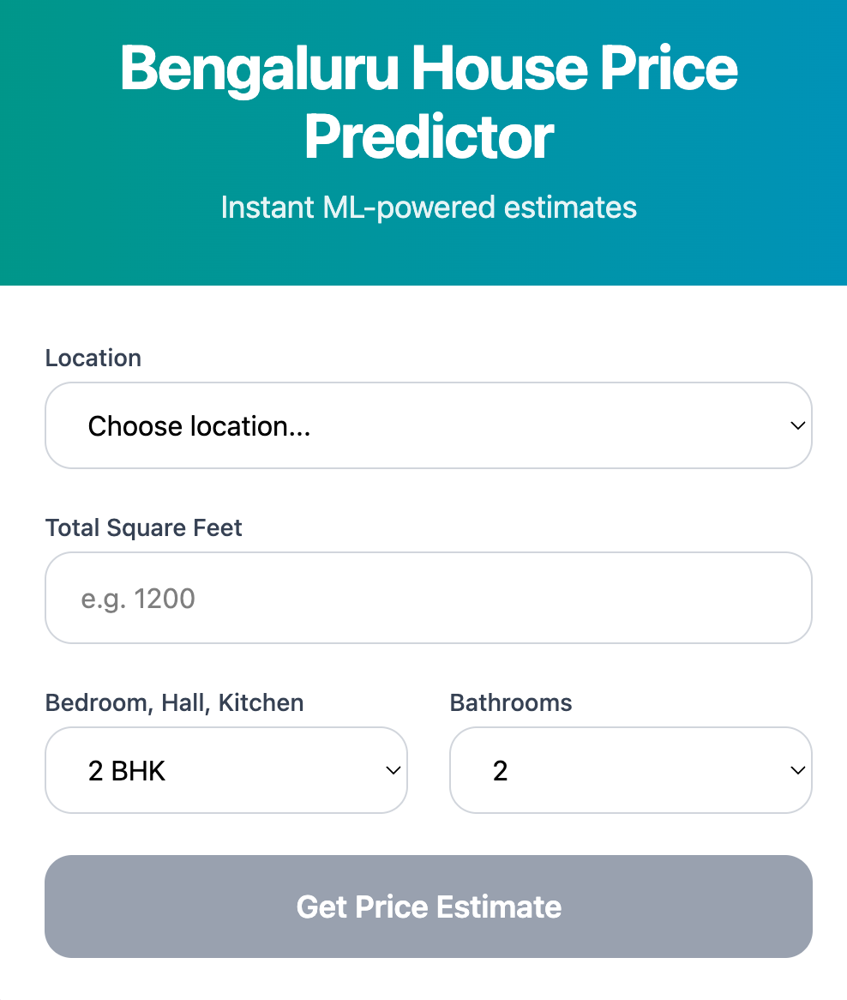

# Bengaluru House Price Predictor



**A full-stack Machine Learning web application** that predicts house prices in Bengaluru using historical data.

Built with a clean **React frontend**, **Flask backend**, and a **Linear Regression model** trained on the famous Bengaluru House Prices dataset from kaggle.

---

## Features

- Modern, responsive UI with Tailwind CSS + React
- Real-time price prediction
- Auto-populated location dropdown
- Loading states and error handling
- Clean REST API built with Flask
- Trained ML model with 85%+ cross-validation accuracy
- Easy to run locally or deploy

---

## Tech Stack

| Layer          | Technology                                      |
|----------------|-------------------------------------------------|
| **Frontend**   | React + Vite + TypeScript + Tailwind CSS v4     |
| **Backend**    | Flask (Python)                                  |
| **ML Model**   | Linear Regression (scikit-learn)                |
| **Data**       | Pandas, NumPy, Jupyter Notebook                 |
| **Model Save** | Pickle + JSON                                   |
| **CORS**       | Flask-CORS                                      |
| **Development**| VS Code, Postman                                |

---

## Project Structure

```text
BengaluruHousePrices/
├── model/                          ← Data Science + Raw Data
│   ├── BengaluruHousePrices.ipynb  ← Full ML pipeline (EDA, cleaning, training)
│   └── bengaluru_house_prices.csv  ← Original Kaggle dataset
│
├── server/                         ← Flask Backend
│   ├── server.py
│   ├── util.py
│   └── artifacts/
│       ├── bengaluru_home_prices_model.pickle
│       └── columns.json
│
├── client/                         ← React Frontend (Vite)
│   ├── src/App.tsx
│   ├── src/index.css
│   ├── vite.config.ts
│   └── package.json
│
├── README.md
```


---

## Dataset & ML Pipeline

**Dataset**: Kaggle – Bengaluru House Prices

**What was done in `model/BengaluruHousePrices.ipynb`**:
- Data cleaning (missing values, size → BHK, total_sqft range handling)
- Feature engineering (`price_per_sqft`)
- Outlier removal (sqft per BHK + price_per_sqft)
- Dimensionality reduction (rare locations → "other")
- One-Hot Encoding for location
- **Best Model**: Linear Regression (selected after GridSearchCV)
- Model + columns exported to `server/artifacts/`

---

## How to Run the Project

### Step 1: Backend (Flask)

```bash
cd server
pip install flask pandas numpy scikit-learn
python server.py
```
- Server runs at http://127.0.0.1:5000

### Step 2: Frontend (React)

```bash
cd ../client
npm install 
python run dev
```
- Server runs at http://localhost:5173


### API Endpoints (Test with Postman)

#### 1. Get All Locations
**GET** `http://127.0.0.1:5000/get_location_names`

#### 2. Predict Home Price
**POST** `http://127.0.0.1:5000/predict_home_price`

**Body (form-data)**:

| Key          | Example Value          | Type   |
|--------------|------------------------|--------|
| `total_sqft` | `1200`                 | number |
| `location`   | `1st Phase JP Nagar`   | string |
| `bhk`        | `2`                    | number |
| `bath`       | `2`                    | number |

---

### Postman Testing Instructions

1. Start both the Flask server 
2. In Postman:
   - Send a **GET** request to `/get_location_names` → you should see the list of locations.
   - Send a **POST** request to `/predict_home_price` using **Body → form-data** with the keys above.
3. You should receive a JSON response like:
   ```json
   {
     "estimated_price": 85.34
   }